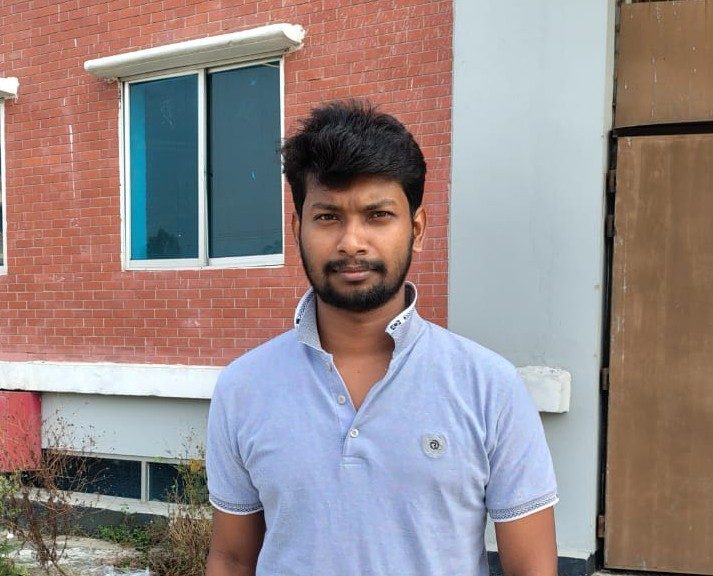

 Md Bakul Mia
### 🌐 Portfolio Website
➡️ Live: https://bakul620.github.io/ 

---

## 🎯 Career Objective

Motivated Computer Science undergraduate with strong problem-solving skills and hands-on experience in C, C++, Java, SQL, and competitive programming. Proficient in algorithms and data structures, with a solid foundation in DBMS. Seeking a software development internship to apply algorithmic thinking, system design fundamentals, and practical project experience while contributing to real-world software solutions.

---

## 🏆 Competitive Programming Background

- Active competitive programmer with strong algorithmic problem-solving skills  
- Solved 2200+ problems on multiple online judges  
- Strong understanding of Data Structures, Greedy, Dynamic Programming, and Graph Algorithms  
- Regularly analyze time and space complexity to optimize solutions  

### 📊 Profiles & Ratings

- Codeforces: Specialist  
- AtCoder: 880 (MAX)  
- CodeChef: 3★ (Three Star)  

### 🏅 Programming Contests

- ICPC Asia Dhaka Regional Preliminary – Participated in 2024 & 2025  
- 200+ online contests across Codeforces, CodeChef, AtCoder  

---

## 💻 Technical Skills

### Programming Languages
- C  
- C++  
- Java  

### Database
- SQL  
- Oracle SQL Developer  
- SQL Server  

### Core Concepts
- Object-Oriented Programming (OOP)  
- DBMS Fundamentals  
- Operating System Basics  
- Data Structures & Algorithms  
- Time & Space Complexity Analysis  

### Tools & Platforms
- Git & GitHub  
- VS Code  

---

## 🚀 Projects

### 🌍 Multilingual Calendar Application (C Language)
Academic Project — 2nd Year (2.1)

- Developed a calendar application with English, Bangla, and Arabic support  
- Implemented date calculation and calendar logic  
- Designed multilingual display system  
- Strengthened understanding of structured programming  

---

## 🎓 Education

**B.Sc in Computer Science and Engineering (2023–2027)**  
Mawlana Bhashani Science and Technology University  

**EDGE Project C# (.NET) Course (March 2025 – Sept 2025)**  
Bangladesh Computer Council & Dept. of CSE, MBSTU  

---

## 🤝 Soft Skills

- Strong analytical thinking  
- Quick learner  
- Effective teamwork  
- Good time management  
- Clear communication skills  

---

## 🎯 Interests

- Competitive Programming  
- Software Development  
- Algorithm Design  
- Probability & Statistics  
